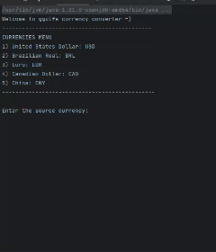

# Gguife currency convertion 



A simple currency converter application built in Java. 
This application allows users to convert between different currencies using an external API (ExchangeRate-AP) to fetch live exchange rates.

---

## Features
- Convert currencies such as USD to BRL, BRL to USD (you can add more currencies).
- Retrieve real-time exchange rates from a currency exchange API.
- Handle user input interactively via the console.

## Tech Stack
- **Java** 
- **External API** for exchange rates (`ExchangeRate-API`)
- **Maven** (or Gradle) for dependency management
- **Gson** (or any other JSON parsing library)

---

## How to Run
### Prerequisites
1. **Java 11 or later** should be installed on your system. You can check if Java is installed by running:
   ```bash
   java -version
   ```
2. **Maven** (or Gradle) to manage dependencies and build the project. If you're using Maven, ensure that it's installed:
   ```bash
   mvn -v
   ```
   
### Setup
1. Clone this repository to your local machine:
   ```bash
   git clone https://github.com/yourusername/currency-converter.git
   cd currency-converter
   ```
2. Install dependencies (using Maven):
   ```bash
   mvn install
   ```
3. Run the application:
   ```bash
   mvn exec:java -Dexec.mainClass="com.currency.CurrencyApplication"
   ```
4. The application will prompt you to enter the source and target currencies, as well as the amount you want to convert.

---

## Example Interaction
```
Welcome to the gguife currency converter =)
---------------------------------------------
1) Dolar: USD
2) Real brasileiro: BRL
Enter the source currency: 
USD
Enter the target currency: 
BRL
Enter the amount to convert: 
100
The conversion value: 500.0 (Rate: 5.0)
```

---

## Error Handling
The application handles several potential errors:
- **Invalid currency input**: If the user enters an invalid currency code (other than USD, BRL), the application will inform them.
- **API error**: If the API call fails (e.g., invalid API key or server error), the application will display an appropriate error message.